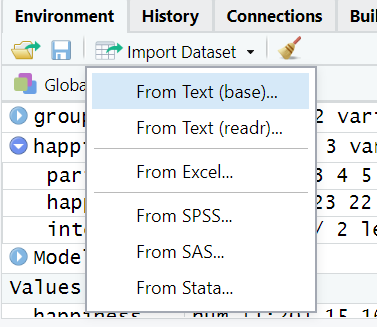
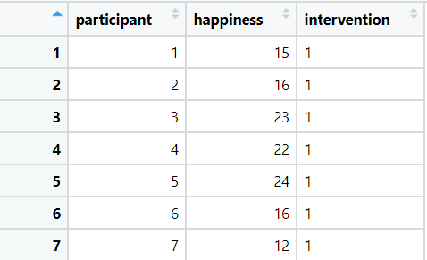
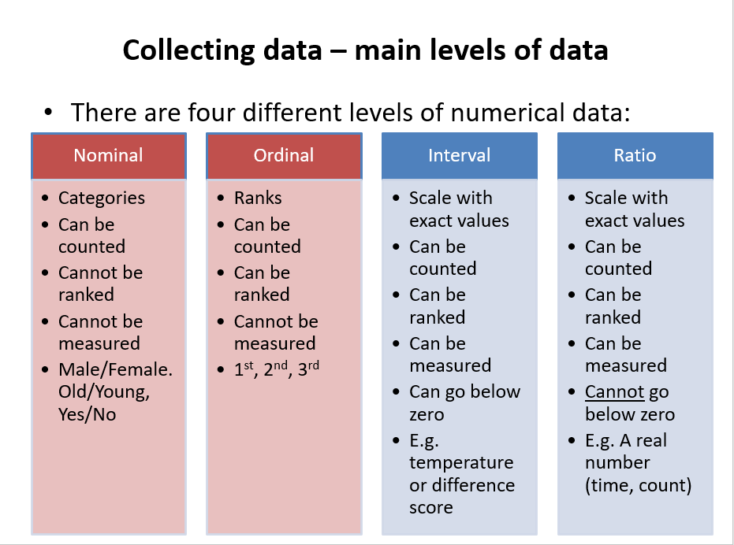

```{r, include = FALSE}
source("R/packages_data.R")
glossary_path("include/glossary.yml")
```


# Working with data in R

<iframe src="https://teesside.hosted.panopto.com/Panopto/Pages/Embed.aspx?id=4d1a880f-b435-465a-95a3-adaa00908325&autoplay=false&offerviewer=true&showtitle=true&showbrand=false&captions=false&interactivity=all" height="405" width="100%" style="border: 1px solid #464646;" allowfullscreen allow="autoplay"></iframe>

## By the end of this section, you will be able to:
- Import data into R from excel, SPSS and csv files
- Save data to `r glossary("object")`
- Identify different data structures and `r glossary("data type", "data types")`
- Convert `r glossary("data type", "data types")` from one type to another
- Order, filter and group data
- Summarise data
- Create new `r glossary("variable (coding)", "variables")` or `r glossary("object", "objects")` from data


## In this section, we will use the <pkg>Tidyverse</pkg> set of packages

-	A ‘toolkit’ of packages that are very useful for organsing and manipulating data
- We will use the <pkg>haven</pkg> package to import SPSS files
- We will use the <pkg>dplyr</pkg> to organise data
- Also includes the <pkg>ggplot2</pkg> and <pkg>tidyR</pkg> packages which we will use later

To install: 


`install.packages(“tidyverse”)`

(See the previous section on installing packages)

## Import data into R from excel, SPSS and csv files

We can import data from a range of sources using the <if>Import Dataset<if> button in the <if>Environment<if> tab:



It is also possible to import data using code, for example:


`
 # importing a .csv file
    
    library(readr)
    studentData <- read_csv("Datasets/studentData.csv")


    #importing an SPSS file
    
    library(haven)
    mySPSSData <- read_sav("datasets/salesData.sav")
`

   

Once the data are imported, it will be visible in the environment: 


## Restructuring and reorganising data in R (long versus wide data)

<iframe src="https://teesside.hosted.panopto.com/Panopto/Pages/Embed.aspx?id=59c0876a-8047-401c-826a-aaec00cbb220&autoplay=false&offerviewer=true&showtitle=true&showbrand=false&start=0&interactivity=all" height="405" width="100%" style="border: 1px solid #464646;" allowfullscreen allow="autoplay"></iframe>

## Understanding objects in R

In R, an `r glossary("object")` is anything that is saved to memory. For example, we might do some analysis:

`mean(happiness)`

     
However, in the example above, the result would appear in the console but not be saved anywhere. To store the result for reuse later, we save it to an object: 

```{r eval=T}
happinessMean <- mean(happiness)
```


In the above code (reading left to right):

- We name the object "happinessMean". This name can be anything we want.
- The arrow means that the result of the code on the right will be saved to the object on the left.
- The code on the right of the arrow calculates the mean of *happiness* data   
    
When this code is run, *happinessMean* will be stored in the environment window:


To recall an object from the environment, we can simply type its name. For example:


```{r eval=T, echo=T}
 happinessMean
```
 
    
> Its important to note that anything can be stored as an object in R and recalled later. This includes, dataframes, the results of statistical calculations, plots etc.

## Identify different `r glossary("data container", "data structures")` and variable types

### Data structures (sometimes referred to as "`r glossary("data container", "data containers")`")

There are many different types of data structures that R can work with. The most common type of data for most people tends to be a `r glossary("data frame")`. A `r glossary("data frame")` is what you might consider a "normal" 2-dimensional dataset, with rows of data and columns of variables:



R can also use other data types.

A `r glossary("vector")` is a one-dimensional set of values:

```{r}
# a vector example

scores <- c(1,4,6,8,3,4,6,7)

```

A `r glossary("matrix")` is a multi-dimensional set of values. The below example is a 3-dimensional matrix, there are 2 groups of 2 rows and 3 columns:

```{r echo=F}
#  a matrix example

myMatrix <-array(1:12,dim=c(2,3,2))

myMatrix
```

> We will primarily work with dataframes (and sometimes vectors), as this is how the data in psychology research is usually structured.

### Data types

With numerical data, there are 4 key `r glossary("data type", "data types")`:

- `r glossary("factor (data type)")` or nominal (a category, group or factor)
- `r glossary("ordinal")` (a ranking)
- `r glossary("interval (data type)")` (scale data that can include negative values)
- `r glossary("ratio (data type)")` (scale data that cannot include negative values)


R can use all of these variable types:


- **Nominal** variables are called **factors**
- **Ordinal** variables are called **ordered factors**
- **Interval and ratio** variables are called **numeric** data and can sometimes be called integers (if they are only whole numbers) or doubles (if they all have decimal points)

R can also use other data types such as text (`r glossary("character")`) data.

### Convert variables from one data type to another

When we first import data into R, it might not recognise the data types correctly. For example, in the below data, we can see the **intervention** variable :

```{r echo=F}
# happinessSample$intervention <- as.numeric(happinessSample$intervention)
happinessSample %>% arrange(by = happiness) %>% head(10)
```
In the **intervention** variable, the numbers 1 and 2 refer to different intervention groups. Therefore, the variable is a `r glossary("factor (data type)")` variable. To ensure that R understands this, we can resave the intervention variable as a factor using the `as.factor()` function:

```{r}
happinessSample$intervention <- as.factor(happinessSample$intervention)
```


## Working with dataframes

`r glossary("dataframe", "Dataframes")` are the more standard data format that were are used to (think of how a dataset looks in SPSS or Excel).

In a `r glossary("dataframe")`, variables are columns and each row usually reperesents one measurement or one participant.

### View dataframe

To view a dataframe, we can click on it in the <inf>environment</inf> window and it will display:


### Refer to variables (columns) in a dataframe

Columns in a dataframe are accessed using the "$" sign. For example, to access the *happiness* column in the *happinessSample* dataframe, we would type:

```{r}
happinessSample$happiness

```

As we can see above, the result is then displayed.

## Order, filter and group data

If you have the <pkg>tidyverse</pkg> package loaded, it is easy to organise and filter data.


```{r arrange data}

arrange(happinessSample, happiness)
arrange(happinessSample, desc(happiness)) # Arrange in descending order
```

- Show clients with a happiness score of less than 4

```{r filter data}

filter(happinessSample, happiness < 4)
```

- Show Intervention group 2 with happiness scores above 7

```{r filter data 2}

filter(happinessSample, happiness > 7 & intervention == 2)
```

- Group by intervention and show the mean happiness score

```{r}
happinessSample %>% group_by(intervention) %>% summarise(mean = mean(happiness))
```


## Create new variables / objects from data

To create new variables from data, we can use the **mutate()** function.

For example, let's say we wanted to calculate the difference between each person's happiness score and the mean happiness score.

We could do the following:

```{r}
happinessSample %>% mutate(difference = happiness - mean(happiness))
```

